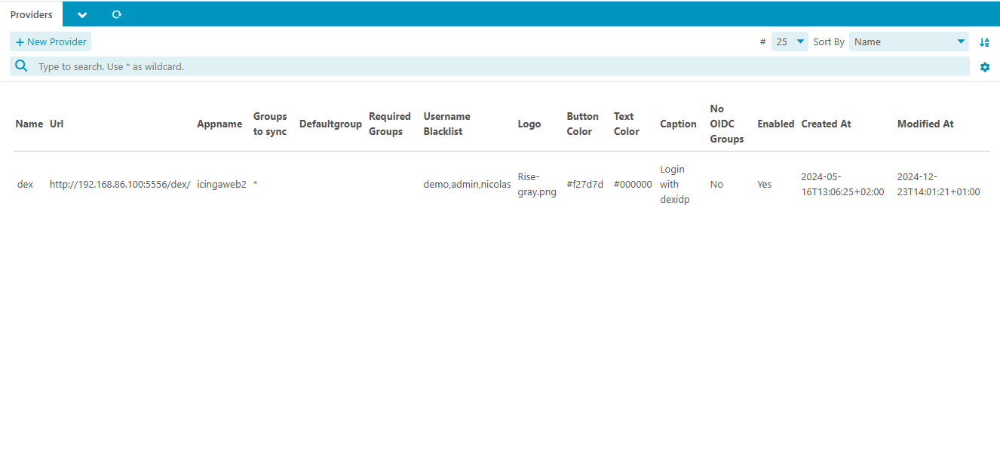
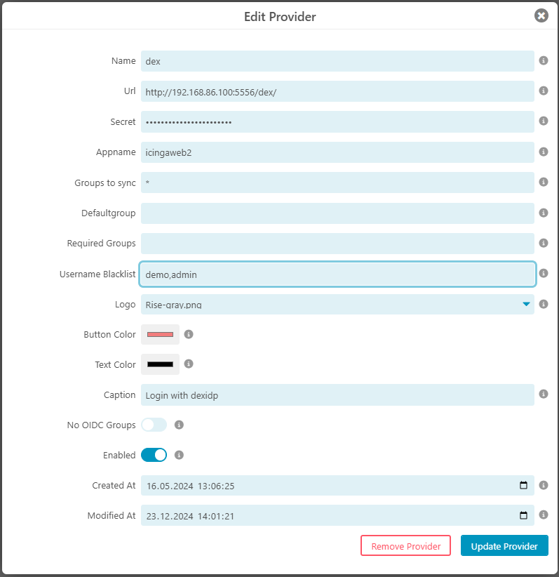
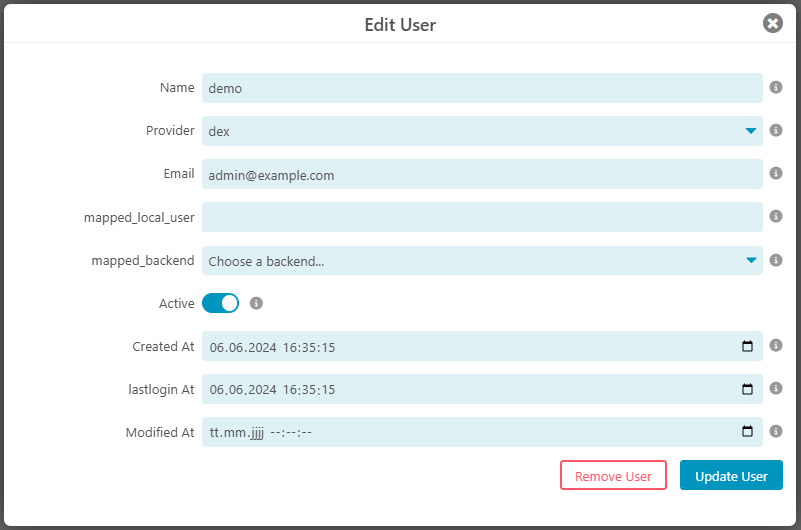
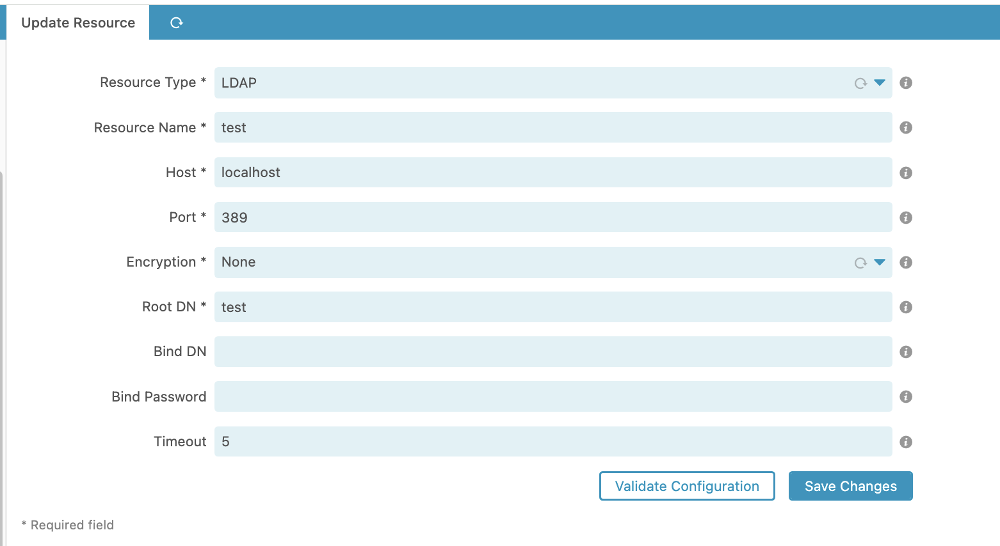
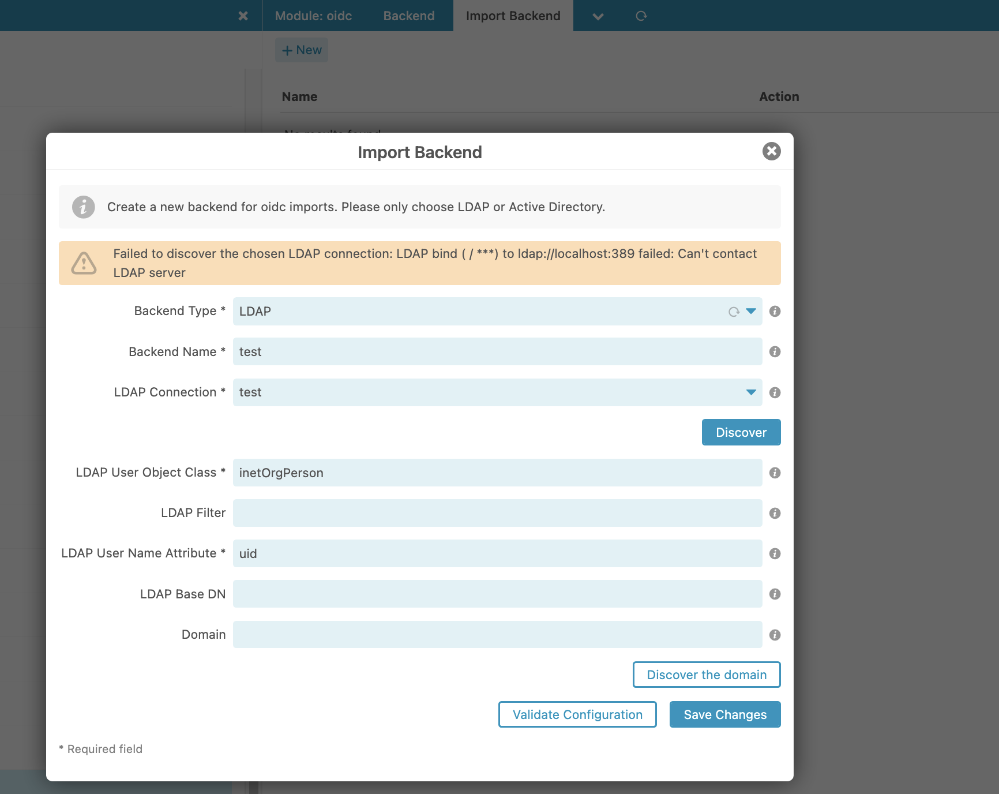

# Configuration <a id="module-oidc-configuration"></a>
In order to use OIDC you first need to specify providers.
Get the following information from your Provider:
* Appname
* Secret
* redirect Url

When setting up this at your OIDC provider you need to specify an url the OIDC provider is allowed to redirect back after successful login:

``` http(s)://your-icingaweb2-instance/icingaweb2/oidc/authentication/realm?name=<name of the provider> ```


## Provider Configuration  <a id="module-oidc-configuration-provider"></a>




| Option                | Required | Description                                                                                                                                                         |
|-----------------------|----------|---------------------------------------------------------------------------------------------------------------------------------------------------------------------|
| Name                  | **yes**  | A Name of the provider                                                                                                                                              |
| Url                   | **yes**  | Url to redirect to the provider.                                                                                                                                    |
| Secret                | **yes**  | Shared secret for the provider                                                                                                                                      |
| Appname               | **yes**  | Appname for the provider                                                                                                                                            |
| Groups to sync        | no       | A comma seperated list of groups to sync for example "grp-icinga-admin*, grp-icinga-user*"                                                                          |
| Defaultgroup          | no       | If this is set each user will get this particular group for example as a baseline of permissions                                                                    |
| Required Groups       | no       | If this is set each user will need to be in one of these groups to be able to login, for example "icinga-login, ubuntu-admin", leave empty if you do not need this. |
| Username Blacklist    | no       | A comma seperated list of usernames that are not allowed to login via oidc, for example "admin, admin-*, root                                                       |
| Logo                  | **yes**  | Choose on of your previously uploaded logos                                                                                                                         |
| Button Color          | no       | Color of this OIDC button                                                                                                                                           |                                                                                                                               |
| Text Color            | no       | Text Color of this OIDC button                                                                                                                                      |                                                                                                                                                            |                                                                                                                               |
| Caption               | no       | Caption for the provider                                                                                                                                            |                                                                                                                                                            |                                                                                                                               |
| Azure Groups          | no       | Enable this switch to get groups from your Azure instance                                                                                                |                                                                                                                                                            |                                                                                                                               |
| No OIDC Group Request | no       | Enable this to prevent requesting any groups from the OIDC provider                                                                                                 |                                                                                                                                                            |                                                                                                                               |
| Enabled               | no       | Enable or disable this provider                                                                                                                                     |                                                                                                                                                            |                                                                                                                               |
| Enforce Https on redirect urls  | no       | This option is necessary if you run Icinga Web 2 behind a reverse proxy, since the scheme (https) cannot be detected correctly                                      |                                                                                                                                                            |                                                                                                                               |
| Created At            | no       | A creation time                                                                                                                                                     |                                                                                                                                                            |                                                                                                                               |
| Modified At           | no       | A modification time                                                                                                                                                 |                                                                                                                                                            |                                                                                                                               |




The redirect Url for the OIDC provider to redirect back to icinga in this particular case should look like this:
> https://your-icingaweb2-instance/icingaweb2/oidc/authentication/realm?name=dex

## User Configuration  <a id="module-oidc-configuration-user"></a>



After successful login via your OIDC provider your user and its groups are visible in the database.
You can edit a user object by clicking on the name.

The `mapped_local_user` can be used to impersonate a 'local' user together with the `mapped_backend`.

## Import  <a id="module-oidc-configuration-import"></a>

Sometimes even when using OIDC you want to assign a user manually before an initial login.
This allows you to fetch the account using ldap with the IcingaWeb2 LDAP functionality without using LDAP as a real backend.

* Create an LDAP resource as usual.

* In the OIDC modules configuration create an `Import Backend`
  
* You will see a menu item in the oidc modules menu for importing LDAP user.


