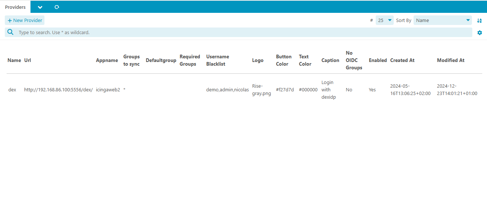
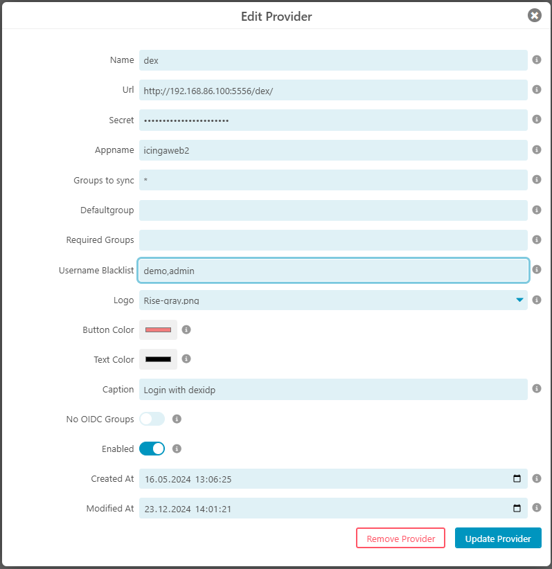
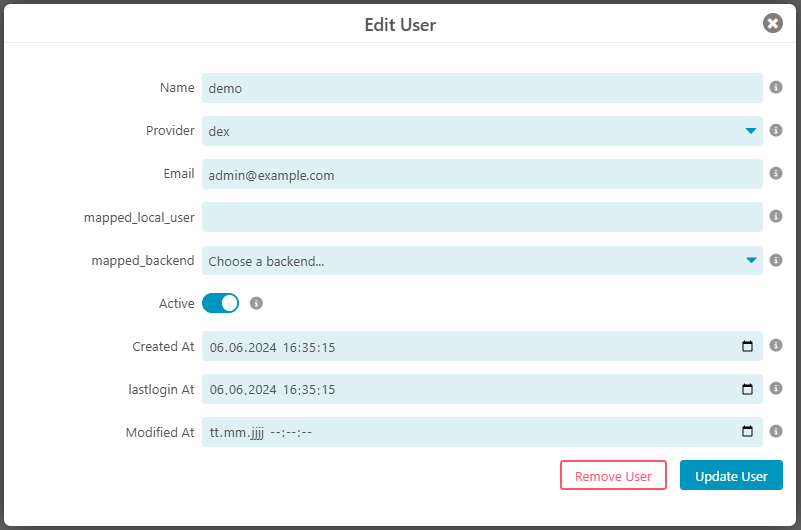
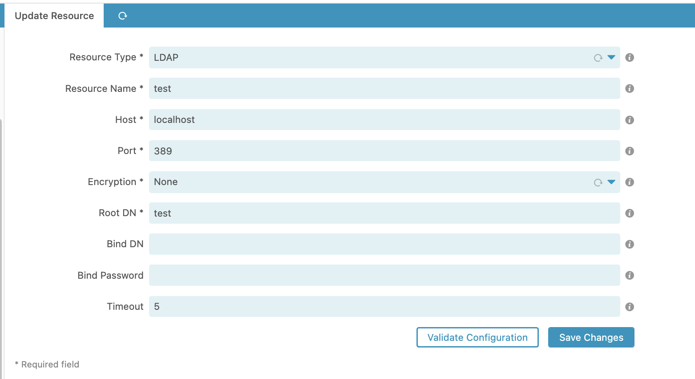
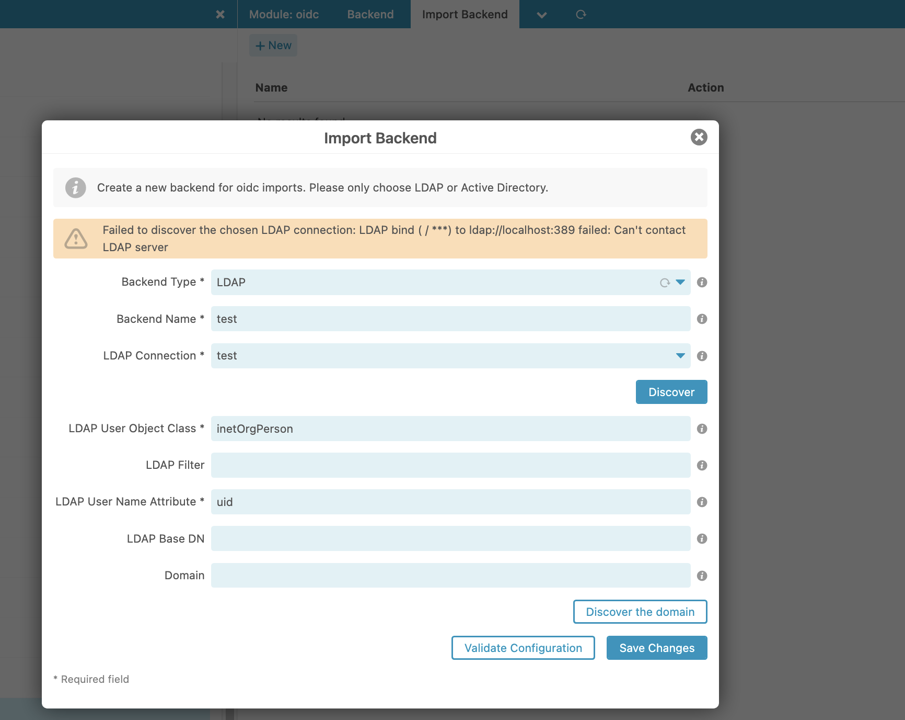

# Configuration <a id="module-oidc-configuration"></a>
In order to use OIDC you first need to specify providers.
Get the following information from your Provider:
* Appname
* Secret
* redirect Url

When setting up this at your OIDC provider you need to specify an url the OIDC provider is allowed to redirect back after successful login:

``` http(s)://your-icingaweb2-instance/icingaweb2/oidc/authentication/realm?name=<name of the provider> ```


## Provider Configuration  <a id="module-oidc-configuration-provider"></a>


> Setting the prefix is completely optional!
>
> Before a user or group is written to the database the prefix is applied but of course this can be an empty string too.
> 
> In every field here that says user or group you have to add this prefix too.
>
> Example: Your oidc username is admin in the group security, you want to use the prefix dexuser_ for all your usernames, and dexgroup_ for all groupnames.
> If you want to sync the group security you need to use `*_security` or `dexgroup_security` or `dexgroup_*` or `*` 
> 
> If you want to sync only the group security use `dexgroup_security`.
> 
> If you want to blacklist the oidc user admin you need to blacklist `dexuser_admin`
> 
> Since a prefix influences permissions which you might changed in the IcingaWeb2 Accesscontrol you can not change a prefix if there is a preexisting user or group using that.


| Option                         | Required | Description                                                                                                                                                                                                  |
|--------------------------------|----------|--------------------------------------------------------------------------------------------------------------------------------------------------------------------------------------------------------------|
| Name                           | **yes**  | A Name of the provider                                                                                                                                                                                       |
| Url                            | **yes**  | Url to redirect to the provider.                                                                                                                                                                             |
| Secret                         | **yes**  | Shared secret for the provider                                                                                                                                                                               |
| Appname                        | **yes**  | Appname for the provider                                                                                                                                                                                     |
| Username Blacklist             | no       | A comma seperated list of usernames that are not allowed to login via oidc, for example "admin, admin-*, root                                                                                                |
| Logo                           | no       | Choose on of your previously uploaded logos                                                                                                                                                                  |
| Button Color                   | no       | Color of this OIDC button                                                                                                                                                                                    |                                                                                                                               |
| Text Color                     | no       | Text Color of this OIDC button                                                                                                                                                                               |                                                                                                                                                            |                                                                                                                               |
| Caption                        | no       | Caption for the provider                                                                                                                                                                                     |                                                                                                                                                            |                                                                                                                               |
| Custom Username                | no       | By default the "name" in the claim will be used as your oidc users username, here you can overrude this as long as the property exists. If if dows not exist there is a fallback on "name"                   |                                                                                                                                                            |                                                                                                                               |
| Username Prefix                | no       | The username will be prefixed by this for example the Prefix "DEXIDP " will cause all usernames to be "DEXIDP <Username>", don´t forget the space, this can not be changed if the provider created a user    |                                                                                                                                                            |                                                                                                                               |
| Groupname Prefix               | no       | The groupname will be prefixed by this for example the Prefix "DEXIDP " will cause all groupnames to be "DEXIDP <Groupname>", don´t forget the space, this can not be changed if the provider created a group |                                                                                                                                                            |                                                                                                                               |
| Groups to sync                 | no       | A comma seperated list of groups to sync for example "grp-icinga-admin*, grp-icinga-user*"                                                                                                                   |
| Defaultgroup                   | no       | If this is set each user will get this particular group for example as a baseline of permissions                                                                                                             |
| Sync Groups                    | no       | A comma seperated list of groups to sync for example "grp-icinga-admin*, grp-icinga-user*"                                       |
| Required Groups                | no       | If this is set each user will need to be in one of these groups to be able to login, for example "icinga-login, ubuntu-admin", leave empty if you do not need this.                                          |
| Azure Groups                   | no       | Enable this switch to get groups from your Azure instance                                                                                                                                                    |                                                                                                                                                            |                                                                                                                               |
| No OIDC Group Request          | no       | Enable this to prevent requesting any groups from the OIDC provider                                                                                                                                          |                                                                                                                                                            |                                                                                                                               |
| PKCE client (S256) | no | Enable PKCE client |
| Enabled                        | no       | Enable or disable this provider                                                                                                                                                                              |                                                                                                                                                            |                                                                                                                               |
| Enforce Https on redirect urls | no       | This option is necessary if you run Icinga Web 2 behind a reverse proxy, since the scheme (https) cannot be detected correctly                                                                               |                                                                                                                                                            |                                                                                                                               |
| Created At                     | no       | A creation time                                                                                                                                                                                              |                                                                                                                                                            |                                                                                                                               |
| Modified At                    | no       | A modification time                                                                                                                                                                                          |                                                                                                                                                            |                                                                                                                               |




The redirect Url for the OIDC provider to redirect back to icinga in this particular case should look like this:
> https://your-icingaweb2-instance/icingaweb2/oidc/authentication/realm?name=dex

## User Configuration  <a id="module-oidc-configuration-user"></a>



After successful login via your OIDC provider your user and its groups are visible in the database.
You can edit a user object by clicking on the name.

The `mapped_local_user` can be used to impersonate a 'local' user together with the `mapped_backend`.

## Import  <a id="module-oidc-configuration-import"></a>

Sometimes even when using OIDC you want to assign a user manually before an initial login.
This allows you to fetch the account using ldap with the IcingaWeb2 LDAP functionality without using LDAP as a real backend.

* Create an LDAP resource as usual.

* In the OIDC modules configuration create an `Import Backend`
  
* You will see a menu item in the oidc modules menu for importing LDAP user.

## Experimental  <a id="module-oidc-configuration-experimental"></a>
Under the Backend config you will also find all the settings that are experimental and can be turned on.

### Relogin
When enabled, the module stores the last OIDC login URL in the `oidc-internalurl`
cookie. Opening the login page then starts OIDC authentication automatically.

Explicit logout clears this cookie and opens the login page with an
`oidc-logout=1` parameter, which bypasses automatic reauthentication.

This feature changes the `AuthenticationHook` logout flow. Enable it only when
no other authentication hook implements `onLogout()`.


