# Azure Configuration 

The Azure configuration in Microsoft 356 should look like the following:

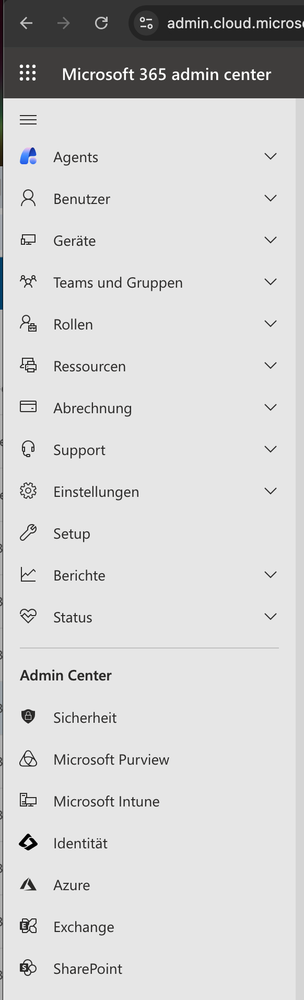

* Click on Azure

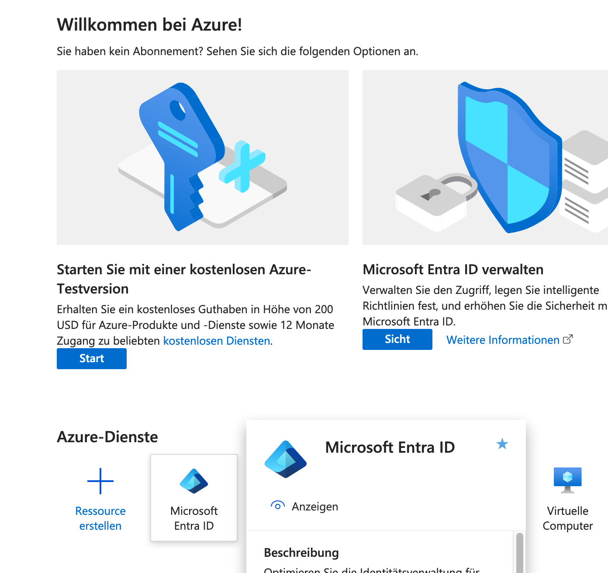

* Click on Microsoft Entra ID

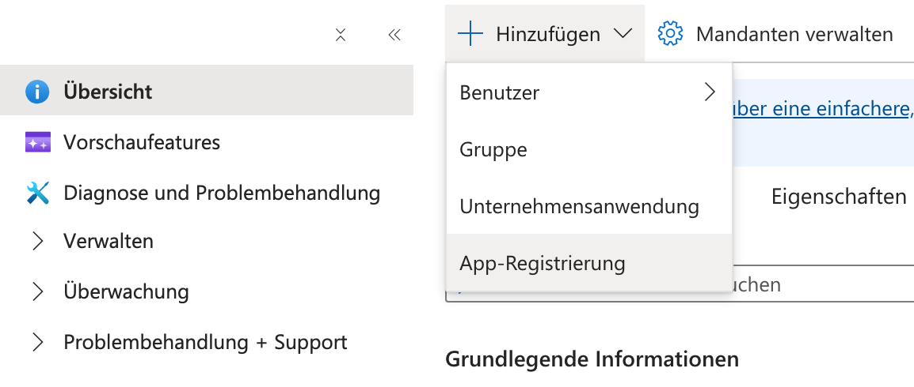

* Start your App Registration Process

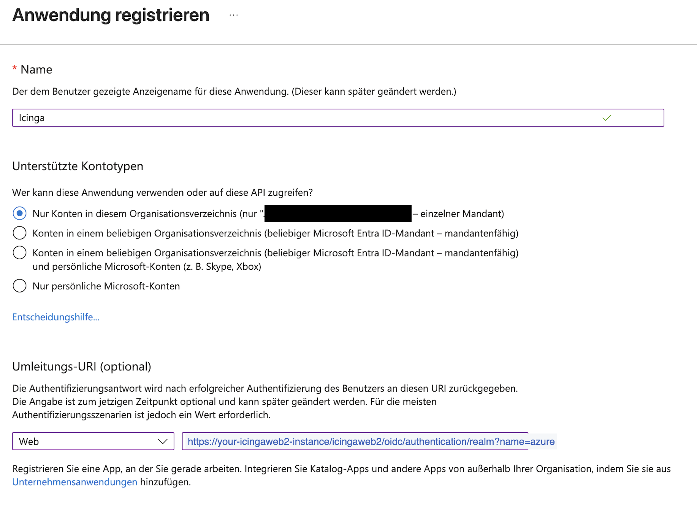

* If you name in the oidc module is azure your url should look like this:
> https://your-icingaweb2-instance/icingaweb2/oidc/authentication/realm?name=azure

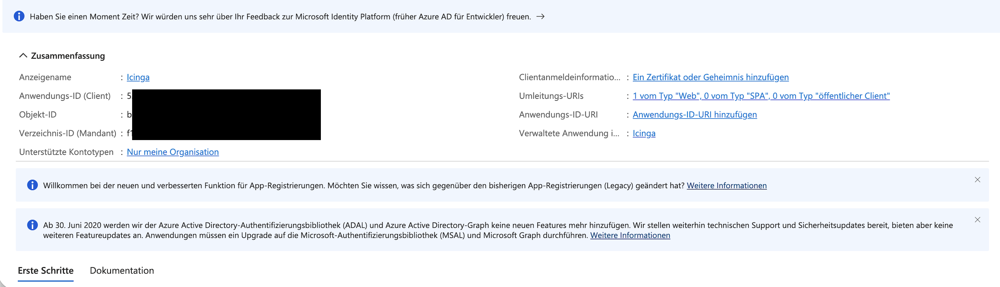

* write down your Application ID you need to use this in your IcingaWeb2 OIDC provider settings

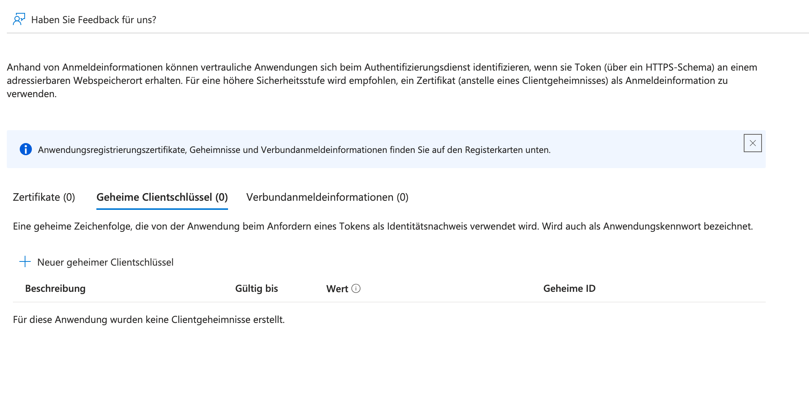

Generate a secret key

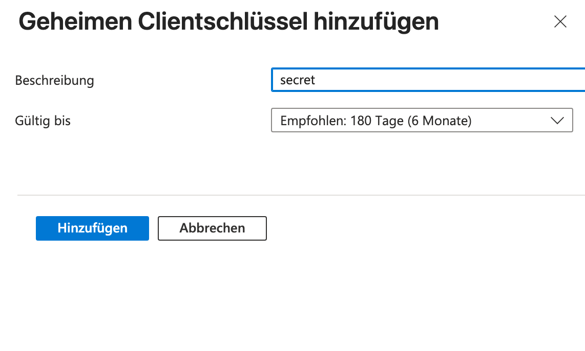

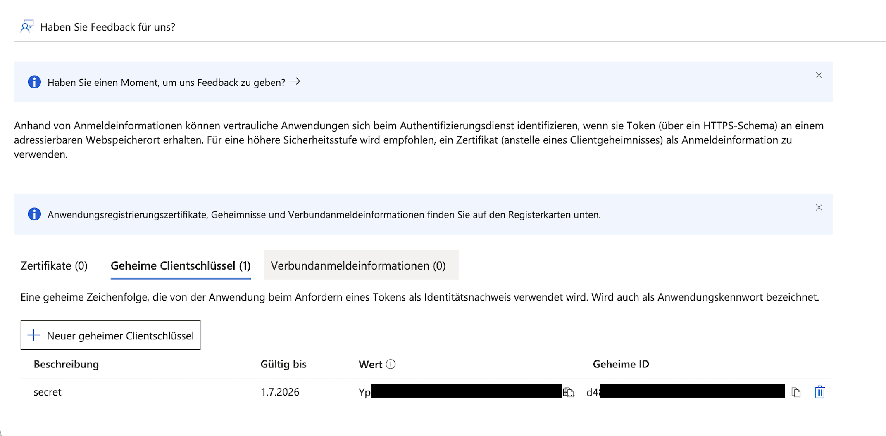

* Write down the value you need to use this in your IcingaWeb2 OIDC provider settings

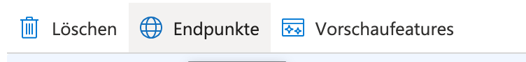

* look for the Endpoints Menu Item

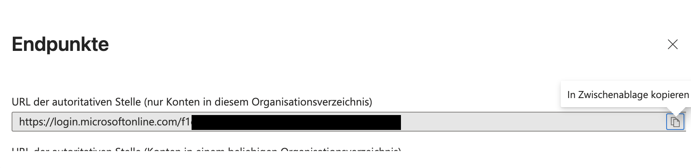

* Copy the first URL you need to use this in your IcingaWeb2 OIDC provider settings

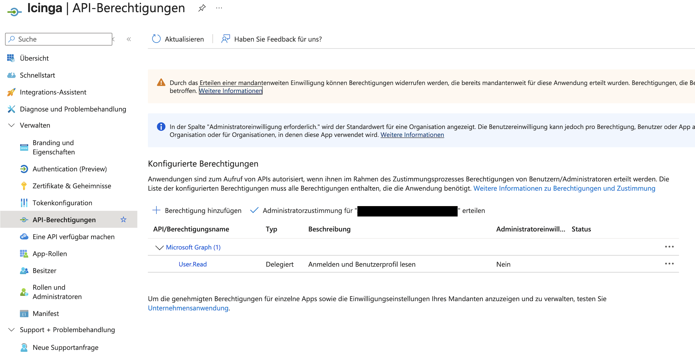

* Got to the API Permissions section and add new permissions

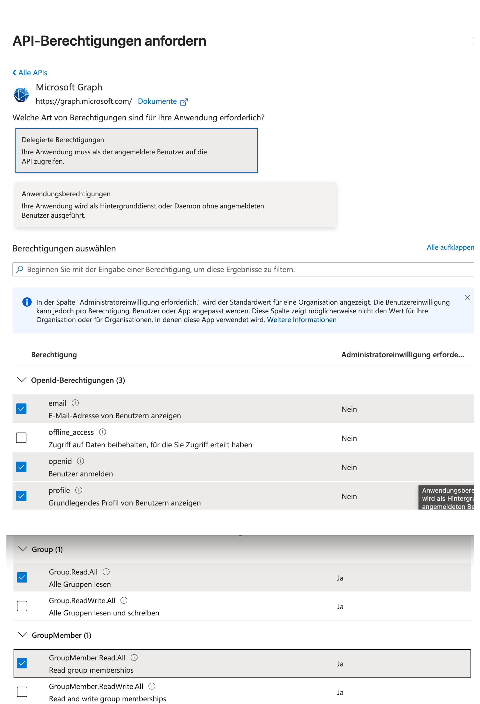

* Select all permissions as shown in this picture.

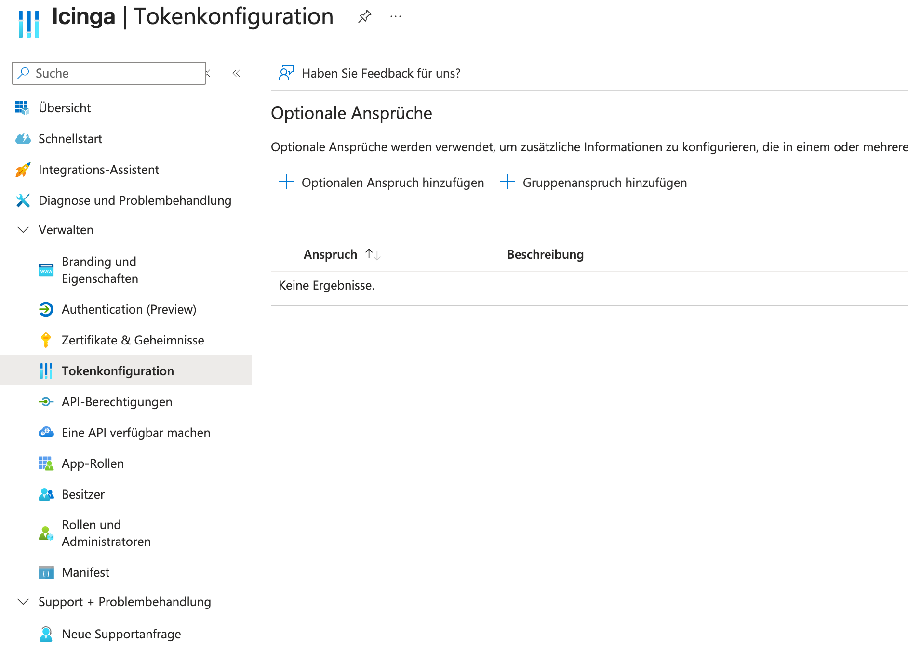

* Goto the token Configuration and add additional requests.

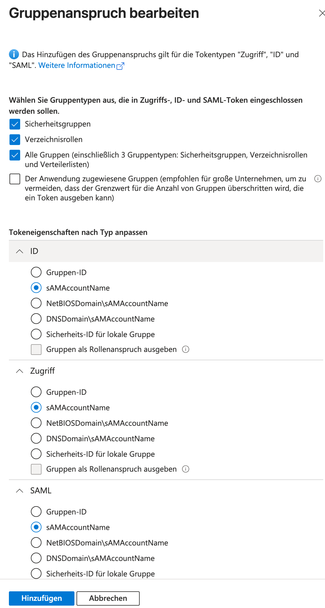

* Here we want the groups by samaccountname

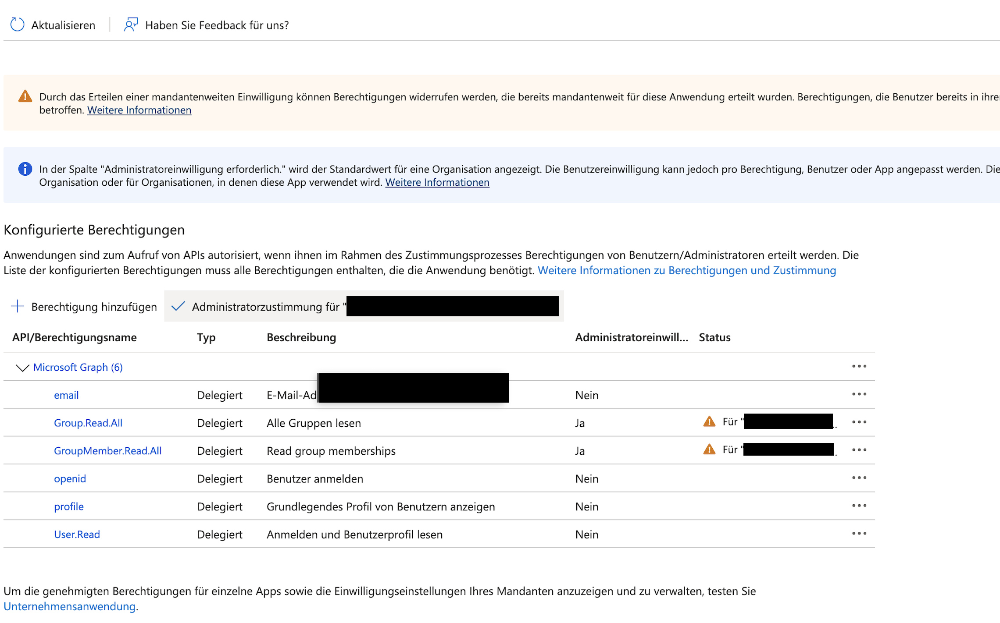

* Since this need additional grants, click on the check sign and grant the access.

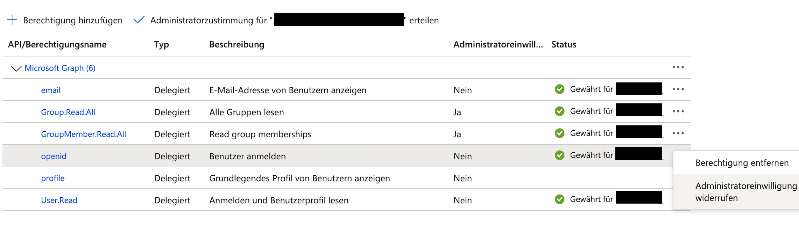

* If you want you can remove the parts the user has access to anyway.

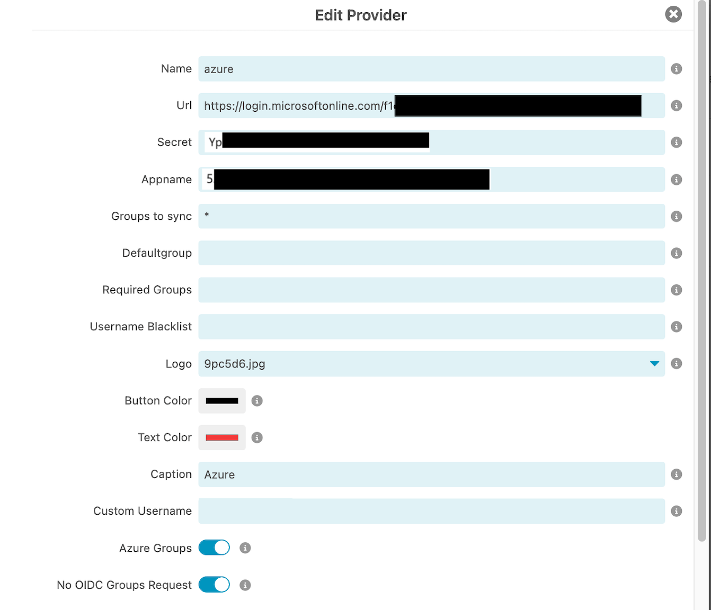
* now we add the URL from the Endpoint window
* the generated secret as secret
* the Application ID as Appname
* tick azure groups
* tick the no OIDC groups Request